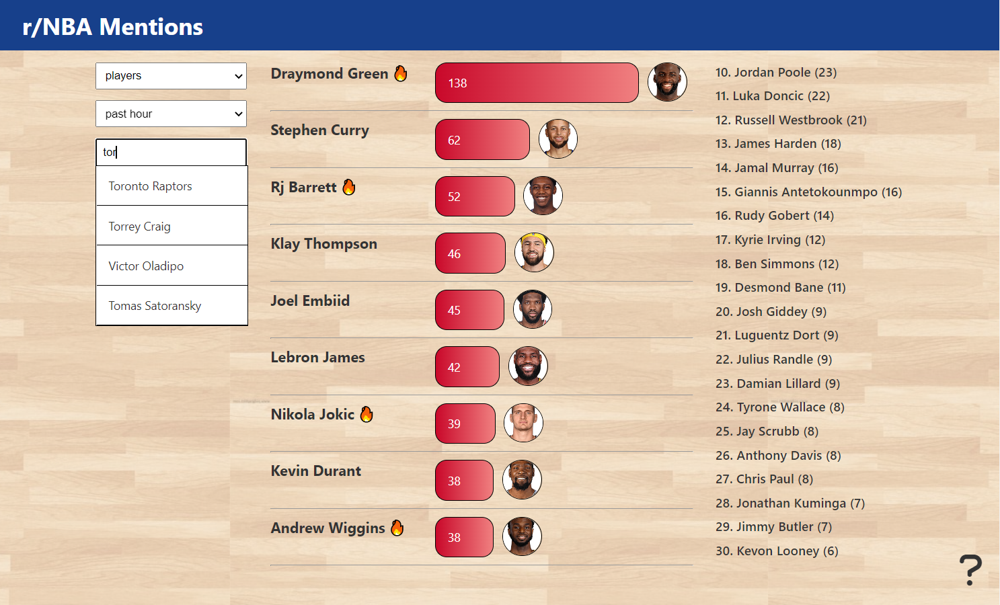

# nbamentions

https://nbamentions.com

Site that displays the most popular players and teams on the r/NBA subreddit. Filter by different time frames to see who is trending. Click on or search for teams and players to see their biggest fans and what comments they've been mentioned in.

---




---

### Backend

* The backend is an HTTP API done in **Python** with **Flask**.

* Uses the **PRAW** API to scrape Reddit comments and upload info to a **PostgreSQL** database.

* It's hosted on **Heroku**.

* The code for the backend can be found [here](https://github.com/rileythomp/redditbots).

### Frontend

* The frontend is done with **Angular** and **TypeScript**.

* It's hosted on Netlify.

---

To run the backend:
* Must set required environment variables (see env.sh).
* Must have a PostgreSQL database with the schema in `setup.sql`.
* Must have Python 3 installed (currently using 3.10.5).
```
$ source env.sh
$ pip install -r requirements.txt
$ python nbabot.py
$ python3 wsgi.py
```

To run the frontend:
* Must have npm and the Angular CLI installed (currently using npm 8.11.0, Angular 14.0.7 and node 16.15.1).
```
$ npm i
$ ng serve
```

---
